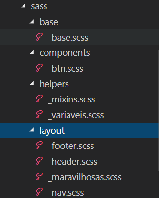
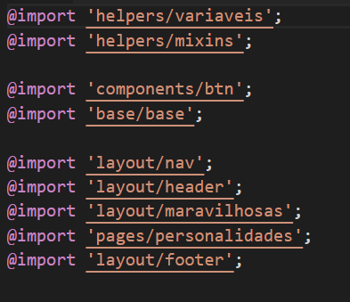
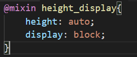
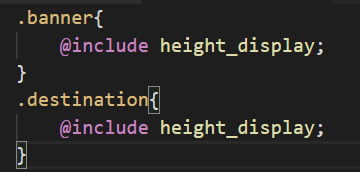
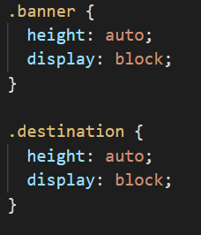
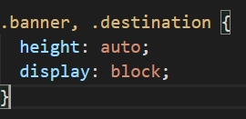
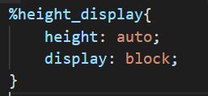
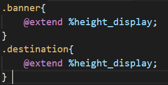

# SEMANA 9 - Pré-processadores

> Nessa semana aprenderemos sobre pré-processadores, utilizando como base o exercício do [Mundo Gelado](https://github.com/reprograma/responsivo/tree/master/exercicio-responsivo-do-zero/mundo-gelado-exercicio-resolvido).
Conforme formos aprendendo, as branches de cada aula serão atualizadas com os conteúdos vistos.

---

### [Aula 1](#aula-01)
#### Resumo:
Nessa aula pegaremos o execício do Mundo Gelado e analisaremos, tirando qualquer dúvida que ainda sobrou sobre CSS. 
Após isso começaremos a ver um pouco sobre pré-processadores, utilizando na prática o [SCSS](https://sass-lang.com/), aprendendo da [instalação](#instalação) até alguns conceitos como:
* [Variáveis](#variáveis)
* [Aninhamento/Nesting](#aninhamento)
* [Mixins](#mixins)

### [Aula 2](#aula-02)
#### Resumo:
Nessa aula aprendemos sobre:
* [Partials](#partials)
* [Imports](#imports)
* [Placeholders e Extends](#placeholders-e-extends)
* [Funções de cor do SASS](#funções-de-cor-do-sass)

---

## Aula 01
Utilizamos o pré-processador [SASS](https://sass-lang.com/) com a sintáxe .scss para poder aproveitar das vantagens desse recurso, mas quais são as vantagens ?
  * Utilizar funcionalidades que o css puro não suporta, como: variáveis, aninhamento, mixins, funções, imports, extends.
  * Evitar duplicação de código
  * Facilidade de código limpo
  * Manutenção de código
#### Instalação
Podemos utilizar dois gerenciadores de pacote para fazer a instalação do SASS. 
  * [gem](https://rubyinstaller.org/), baixando o rubyinstaller. 
  * [npm](https://nodejs.org/en/), baixando o node. 
Para verificar se a instalação ocorreu bem é só escrever <code>gem --version</code> ou <code>npm --version</code> no terminal, o resultado será a versão instalada: 

 

 

Após isso é só escrever **gem install sass** ou **npm install -g sass** e utilizar o *--version* para verificar se a instalação foi concluída: 
 

Para gerar o arquivo scss da raiz do projeto podemos fazer o seguinte comando no terminal: 
sass {pasta do scss}/{nome do arquivo scss}.scss:{pasta onde você quer que o arquivo css seja gerado}/{nome do arquivo css que você quer que seja gerado}.css 
EX: 
  <code>sass scss/style.scss:css/style.css</code>  
E para que qualquer modificação gere um .css enquanto você edita o arquivo scss é só utilizar o *--watch* 
sass --watch {pasta do scss}/{nome do arquivo scss}.scss:{pasta onde você quer que o arquivo css seja gerado}/{nome do arquivo css que você quer que seja gerado}.css 
EX: 
  <code>sass --watch scss/style.scss:css/style.css</code> 
  
#### Variáveis
SCSS: 
 
CSS: 
 
#### Aninhamento
SCSS: 
 
CSS: 
 

#### Mixins
Sem parametros: 
 
Com parametros: 
 
Com parametros e valor padrão: 
 
[Para mais exemplos de mixins](http://blog.caelum.com.br/10-mixins-sass-que-voce-deveria-usar-em-seus-projetos/)

## Aula 02
#### Partials
Para modularizar nosso código e deixar mais fácil de configurar, conseguimos separar em arquivos chamados partials, que são pedaços de css separados em arquivos e que recebem um _ no começo do nome, para que o sass entenda que não deve gerar o código no css, só quando chamarmos por @import. 
Ex: _base.scss  
 

#### Imports
Para fazer com que os nossos partials sejam gerados no css é necessário importá-los no arquivo .scss principal.  
 
**OBS: Lembrando que a ordem que a gente chama os @imports é a ordem que será gerado no css**

#### Placeholders e Extends
Assim como o mixin, os placeholders também são trechos de código que podemos reutilar, mas se ele faz a mesma coisa que o mixin, por que utilizarmos ?  
Vamos exemplificar, criamos o seguinte mixin: 
 
Quando aplicamos ele em dois lugares:  
 
O css gerado é o seguinte:  
 
O ideal seria:  
 
E é que os Placeholders fazem a partir do extend, para criar um placeholder fazemos o seguinte:  
 
E chamamos assim:  
 
O resultado gerado no css agora é como queriamos:  
 
 
Apesar de bem útil, o placeholder possui duas limitações: 
  * Não podemos criar placeholders com parâmetros, como fazemos com os mixins.
  * Os placeholders possuem conflitos ao utilizar junto do @media, podendo gerar esse erro:  
  You may not @extend an outer selector from within @media.  
  You may only @extend selectors within the same directive. 
  
[Para mais exemplos de placeholders](https://blog.teamtreehouse.com/extending-placeholder-selectors-with-sass/)
 
#### Funções de cor do SASS
O SASS possui algumas funções nativas e algumas dela são as de cores:   
http://sass-lang.com/documentation/Sass/Script/Functions.html 
Exemplo da função para deixar mais claro:  
<code>lighten(#829dad, 20%);</code>

