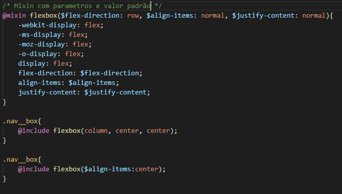

# SEMANA 9 - Pré-processadores

> Nessa semana aprenderemos sobre pré-processadores, utilizando como base o exercício do [Mundo Gelado](https://github.com/reprograma/responsivo/tree/master/exercicio-responsivo-do-zero/mundo-gelado-exercicio-resolvido).
Conforme formos aprendendo, as branches de cada aula serão atualizadas com os conteúdos vistos.

---

### [Aula 1](#aula-1)
#### Resumo:
Nessa aula pegaremos o execício do Mundo Gelado e analisaremos, tirando qualquer dúvida que ainda sobrou sobre CSS. 
Após isso começaremos a ver um pouco sobre pré-processadores, utilizando na prática o [SCSS](https://sass-lang.com/), aprendendo da [instalação](#instalação) até alguns conceitos como:
* [Variáveis](#variáveis)
* [Aninhamento/Nesting](#aninhamento)
* [Mixins](#mixins)

---

## Aula 1
Utilizamos o pré-processador [SASS](https://sass-lang.com/) com a sintáxe .scss para poder aproveitar das vantagens desse recurso, mas quais são as vantagens ?
  * Utilizar funcionalidades que o css puro não suporta, como: variáveis, aninhamento, mixins, funções, imports, extends.
  * Evitar duplicação de código
  * Facilidade de código limpo
  * Manutenção de código
#### Instalação
Podemos utilizar dois gerenciadores de pacote para fazer a instalação do SASS. 
  * [gem](https://rubyinstaller.org/), baixando o rubyinstaller. 
  * [npm](https://nodejs.org/en/), baixando o node. 
Para verificar se a instalação ocorreu bem é só escrever <code>gem --version</code> ou <code>npm --version</code> no terminal, o resultado será a versão instalada: 

 

 

Após isso é só escrever **gem install sass** ou **npm install -g sass** e utilizar o *--version* para verificar se a instalação foi concluída: 
 

Para gerar o arquivo scss da raiz do projeto podemos fazer o seguinte comando no terminal: 
sass {pasta do scss}/{nome do arquivo scss}.scss:{pasta onde você quer que o arquivo css seja gerado}/{nome do arquivo css que você quer que seja gerado}.css 
EX: 
  <code>sass scss/style.scss:css/style.css</code>  
E para que qualquer modificação gere um .css enquanto você edita o arquivo scss é só utilizar o *--watch* 
sass --watch {pasta do scss}/{nome do arquivo scss}.scss:{pasta onde você quer que o arquivo css seja gerado}/{nome do arquivo css que você quer que seja gerado}.css 
EX: 
  <code>sass --watch scss/style.scss:css/style.css</code> 
  
#### Variáveis
SCSS: 
 
CSS: 
 
#### Aninhamento
SCSS: 
 
CSS: 
 

#### Mixins
Sem parametros: 
 
Com parametros: 
 
Com parametros e valor padrão: 
 
[Para mais exemplos de mixins](http://blog.caelum.com.br/10-mixins-sass-que-voce-deveria-usar-em-seus-projetos/)

